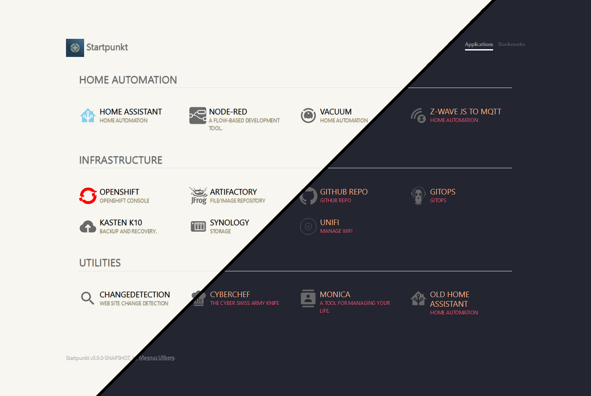

<h1 align="center">
  <a href="https://github.com/ullbergm/startpunkt">
    <!-- Please provide path to your logo here -->
    
  </a>
</h1>

  Startpunkt
   
  <a href="#about"><strong>Explore the screenshots »</strong></a>
   
   
  <a href="https://github.com/ullbergm/startpunkt/issues/new?assignees=&labels=bug&template=01_BUG_REPORT.md&title=bug%3A+">Report a Bug</a>
  ·
  <a href="https://github.com/ullbergm/startpunkt/issues/new?assignees=&labels=enhancement&template=02_FEATURE_REQUEST.md&title=feat%3A+">Request a Feature</a>
  .<a href="https://github.com/ullbergm/startpunkt/discussions">Ask a Question</a>

 

]

Table of Contents

- [About](#about)
  - [Built With](#built-with)
    - [Quarkus](#quarkus)
    - [Vite](#vite)
    - [Preact](#preact)
    - [Bootstrap](#bootstrap)
- [Support](#support)
- [Project assistance](#project-assistance)
- [Contributing](#contributing)
- [Authors \& contributors](#authors--contributors)
- [Security](#security)
- [License](#license)
- [Acknowledgements](#acknowledgements)

---

## About

<table><tr><td>

Startpunkt is a clean startpunkt designed to display links to all your self-hosted resources in your kubernetes cluster. It automatically detects running services in the cluster and adds them to the start page, while offering customization using labels and CRDs.

<a href="bad-link.html">testing a bad link</a>

Screenshots

 

|                               Home Page                               |
| :-------------------------------------------------------------------: |
|  |

</td></tr></table>

### Built With

#### [Quarkus](https://quarkus.io/)

Quarkus provides a way to compile the java code to native binaries, making the container really small and quick to start up.

It also provides several libraries that simplify the development immensely.
* Rest client
* Kubernetes client
* Caching
* Health checks
* Prometheus monitoring
* Deploying a static website builder in the same application

#### [Vite](https://vitejs.dev)
#### [Preact](https://preactjs.com)
#### [Bootstrap](https://getbootstrap.com/)

<!--
## Getting Started

### Prerequisites

> **[?]**
> What are the project requirements/dependencies?

### Installation

> **[?]**
> Describe how to install and get started with the project.

## Usage

> **[?]**
> How does one go about using it?
> Provide various use cases and code examples here.

## Roadmap

See the [open issues](https://github.com/ullbergm/startpunkt/issues) for a list of proposed features (and known issues).

- [Top Feature Requests](https://github.com/ullbergm/startpunkt/issues?q=label%3Aenhancement+is%3Aopen+sort%3Areactions-%2B1-desc) (Add your votes using the 👍 reaction)
- [Top Bugs](https://github.com/ullbergm/startpunkt/issues?q=is%3Aissue+is%3Aopen+label%3Abug+sort%3Areactions-%2B1-desc) (Add your votes using the 👍 reaction)
- [Newest Bugs](https://github.com/ullbergm/startpunkt/issues?q=is%3Aopen+is%3Aissue+label%3Abug)

-->

## Support

Reach out to the maintainer at one of the following places:

- [GitHub Discussions](https://github.com/ullbergm/startpunkt/discussions)
- Contact options listed on [this GitHub profile](https://github.com/ullbergm)

## Project assistance

If you want to say **thank you** or/and support active development of Startpunkt:

- Add a [GitHub Star](https://github.com/ullbergm/startpunkt) to the project.
- Buy me a [coffee](https://buymeacoffee.com/magnus.ullberg).

## Contributing

First off, thanks for taking the time to contribute! Contributions are what make the open-source community such an amazing place to learn, inspire, and create. Any contributions you make will benefit everybody else and are **greatly appreciated**.

Please read [our contribution guidelines](docs/CONTRIBUTING.md), and thank you for being involved!

## Authors & contributors

The original setup of this repository is by [Magnus Ullberg](https://github.com/ullbergm).

For a full list of all authors and contributors, see [the contributors page](https://github.com/ullbergm/startpunkt/contributors).

## Security

Startpunkt follows good practices of security, but 100% security cannot be assured.
Startpunkt is provided **"as is"** without any **warranty**. Use at your own risk.

_For more information and to report security issues, please refer to our [security documentation](docs/SECURITY.md)._

## License

This project is licensed under the **MIT License**.

See [LICENSE](LICENSE) for more information.

## Acknowledgements

* [SUI](https://github.com/jeroenpardon/sui)
* [Hajimari](https://hajimari.io/)
* [Forecastle](https://github.com/stakater/Forecastle)
