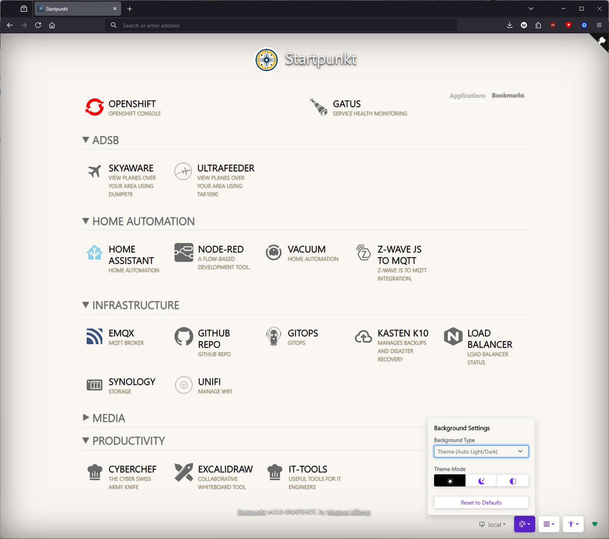
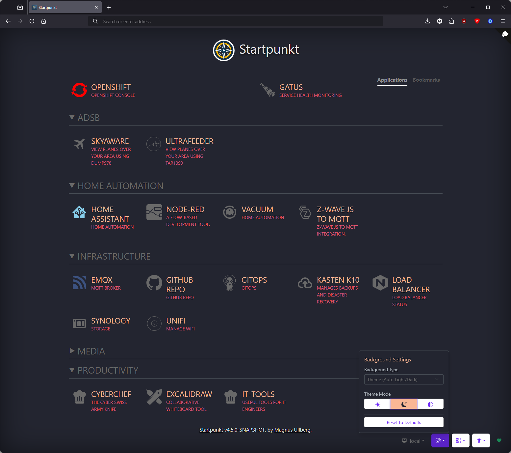
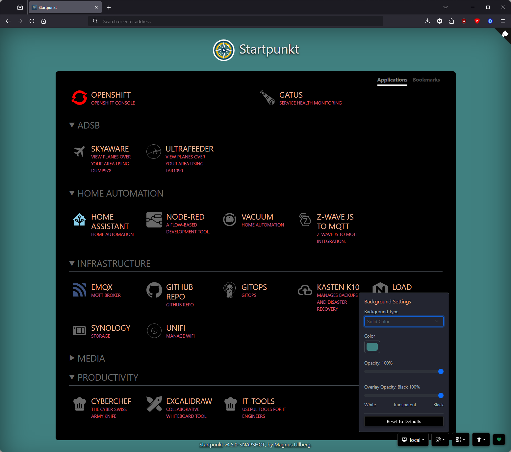
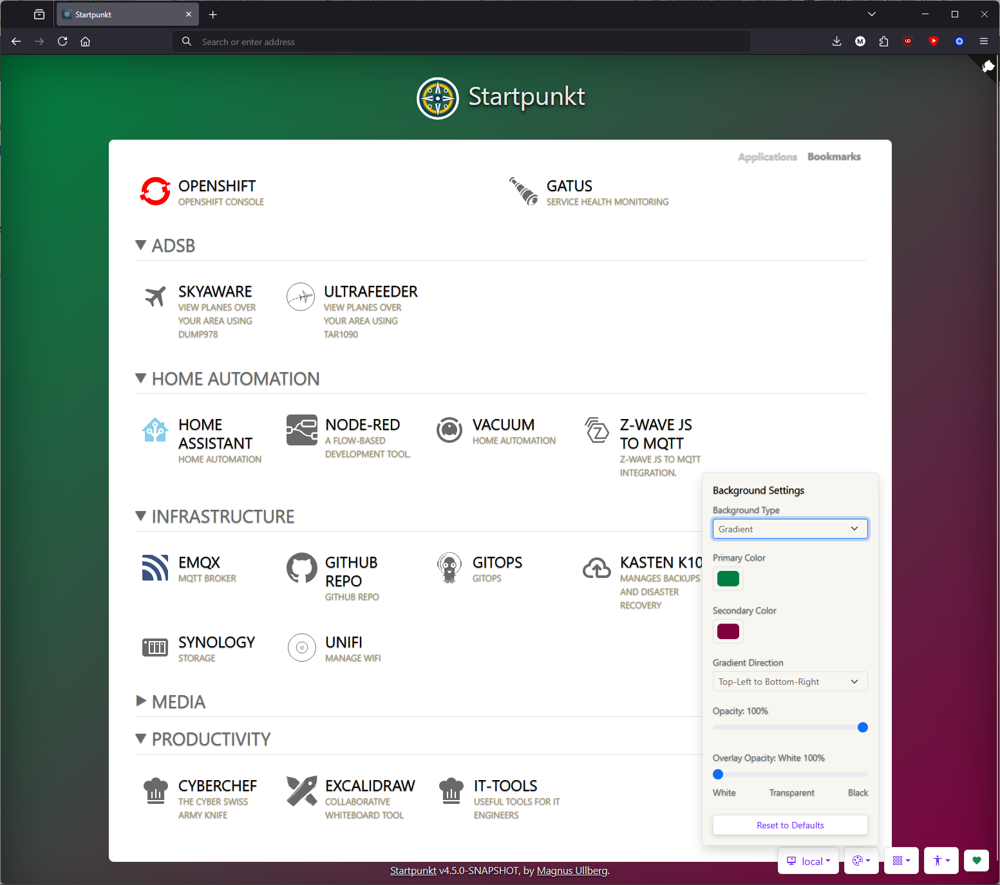
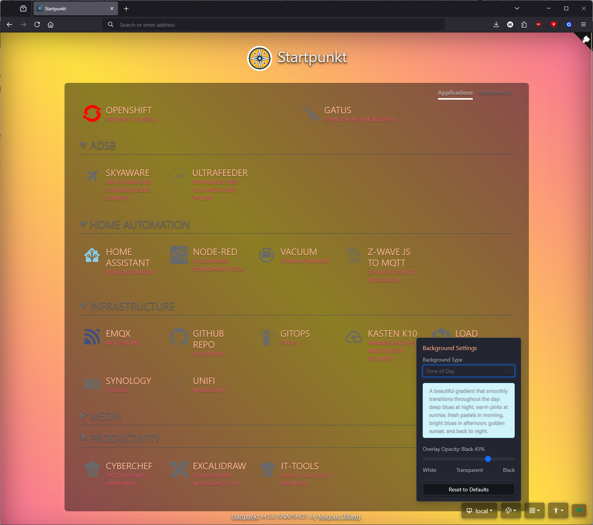
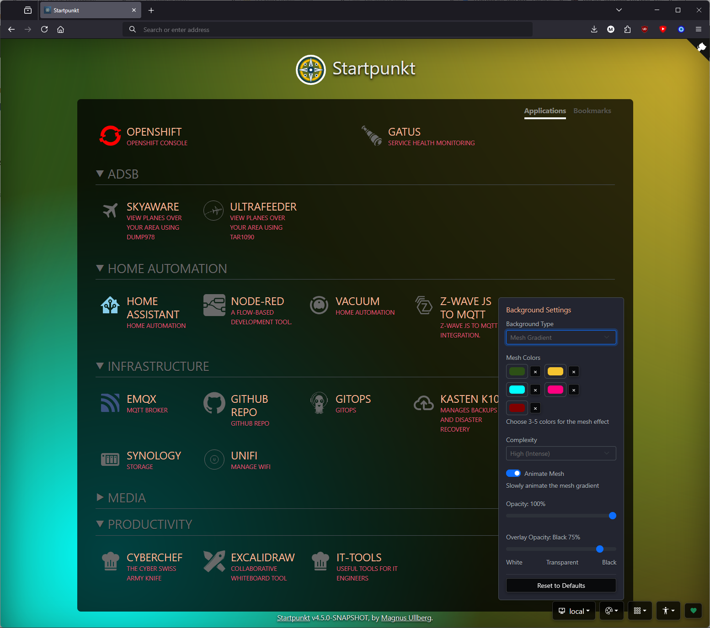
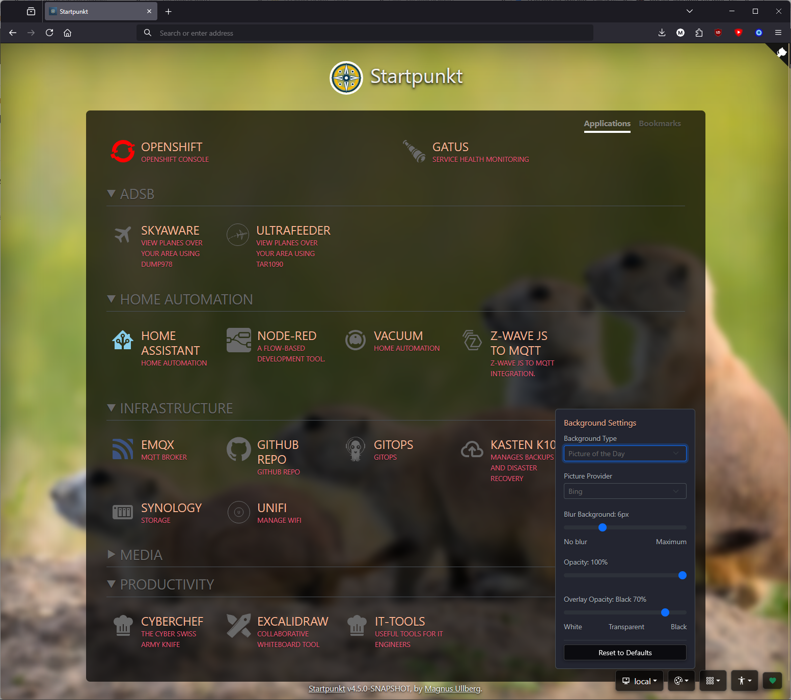
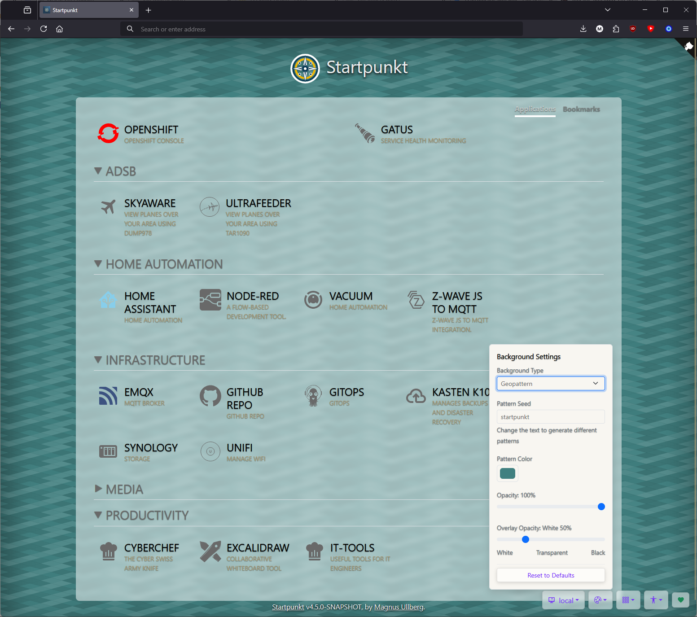
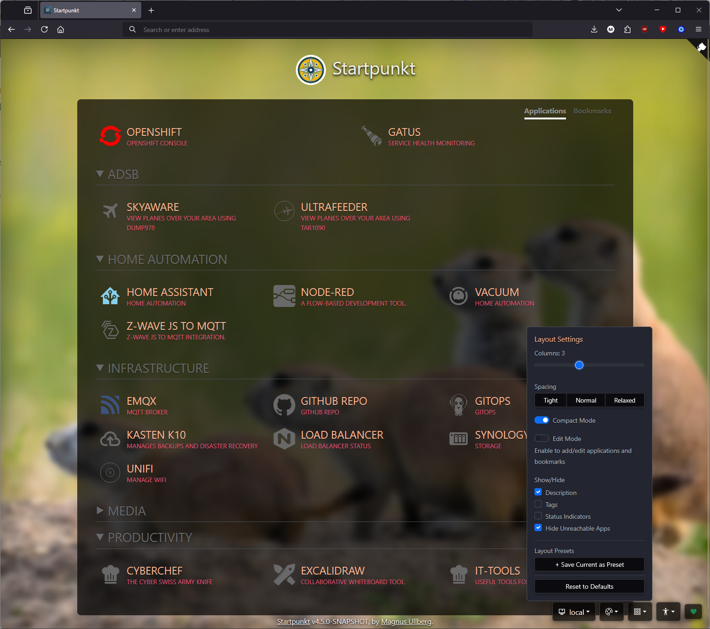
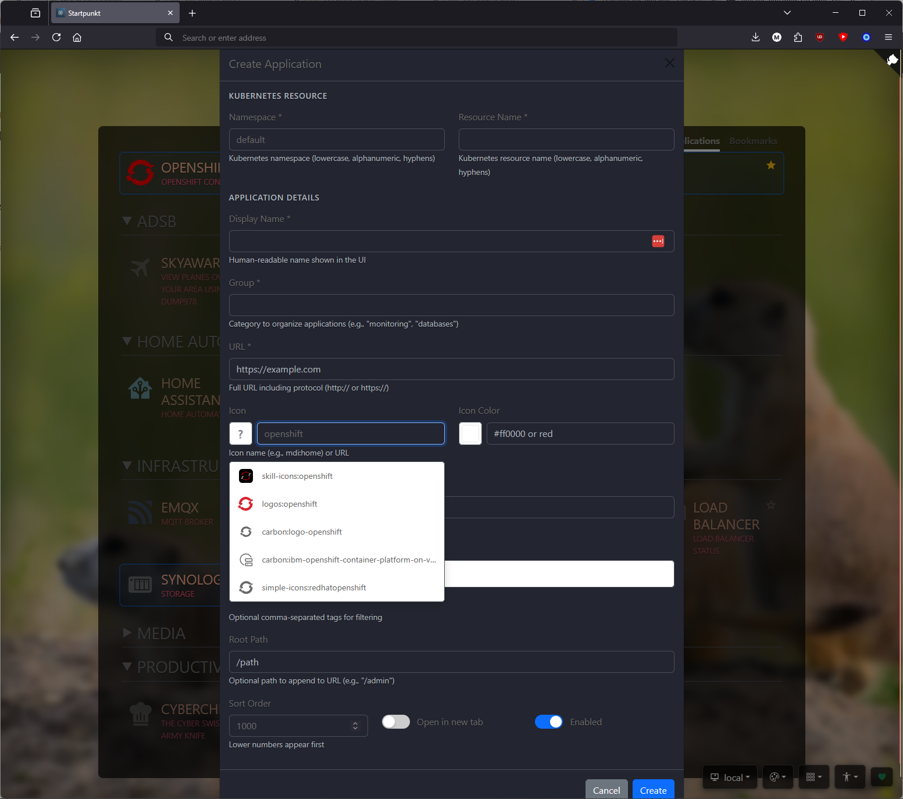

# Startpunkt Feature Screenshots

This directory contains screenshots showcasing Startpunkt's features and capabilities.

## Theme Options

### Light Theme

The default light theme provides a clean, bright interface with excellent readability for daytime use.

### Dark Theme

The dark theme reduces eye strain in low-light environments while maintaining visual hierarchy and contrast.

## Background Styles

### Solid Background

A simple solid color background for a minimalist, distraction-free experience.

### Gradient Background

Smooth gradient backgrounds add visual depth and modern aesthetics to the interface.

### Time of Day Background

Dynamic backgrounds that automatically adjust based on the current time of day for a more immersive experience.

### Mesh Gradient

Advanced mesh gradient backgrounds create stunning, organic color transitions.

### Picture of the Day

Daily rotating background images featuring curated photography or artwork.

### Geopattern Background

Unique geometric patterns generated dynamically for a distinctive visual identity.

## Layout & Features

### Three Column Layout

Flexible multi-column layout that efficiently organizes applications and bookmarks across the screen.

### Create Application

Intuitive interface for adding new applications to your Startpunkt dashboard.

### Remote Instances

Connect and manage multiple remote Kubernetes cluster instances from a single Startpunkt interface.
